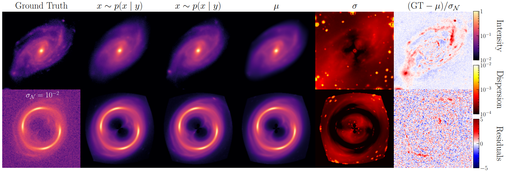
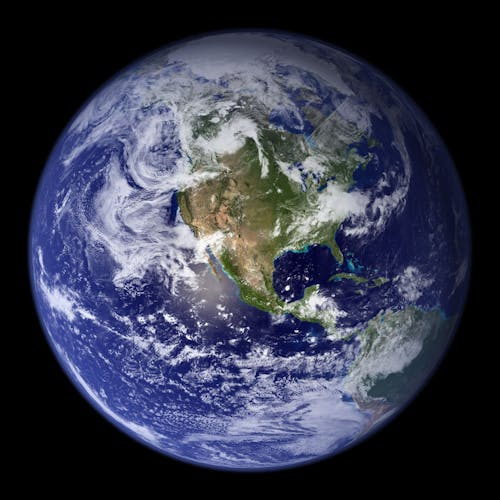
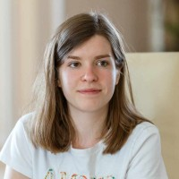

class: middle, center, title-slide

 

# Inverting scientific images with deep generative models

 

AI for Science symposium 
The Royal Swedish Academy of Sciences 
September 4, 2025

.grid[
.kol-1-3[
.width-60.circle[]
]
.kol-2-3[

 
Gilles Louppe 
[g.louppe@uliege.be](mailto:g.louppe@uliege.be)

]
]

???

Good morning everyone, and thank you for the invitation to speak at this symposium, it is a pleasure to be here.

My goal today is to give you a brief overview of some of the work we have been doing at the intersection of deep learning and inverse problems in science. We will look at three different scales of inverse problems, from low-dimensional to extra-large, and see how deep generative models can help us tackle them.

Second, I will also try to explain how deep generative models are not just fancy tools to generate AI slop, but above all how they can help us probe physics that was previously out of reach due to computational limitations. 

This talk will echo some of the themes discussed in previous talks, so this is a good opportunity to connect the dots.

---

class: middle, black-slide, center
background-image: url(figures/y.png)
background-size: cover

.bold.larger[From a noisy observation $y$...]

???

As a motivating example, imagine we have a noisy observation $y$ of some underlying physical process.

The observation could be a low-resolution satellite image of the atmosphere, a noisy medical scan, or simply a photograph taken in low light conditions.

---

class: middle, black-slide, center
background-image: url(figures/x.png)
background-size: cover

.bold.larger[... can we recover   all plausible images $x$?]

???

Our goal today is then quite simple: given the noisy observation $y$, can we recover all plausible physical states $x$ that could have caused this observation?

For instance, if $y$ is a sparse and resolution-limited satellite image of the atmosphere, can we recover the full high-resolution 3d dynamics of the atmosphere which is consistent with this observation?

---

class: middle, black-slide, center

.larger[

$$
\begin{aligned}
    \dot{u} & = - u \nabla u + \frac{1}{Re} \nabla^2 u - \frac{1}{\rho} \nabla p + f \\\\
    0 & = \nabla \cdot u
\end{aligned}
$$

]

.bold.larger[

... or model parameters $\theta = \\\{Re, \rho, f\\\}$?

]

???

If we have a good understanding of the physics, we can also often write down a mathematical model of the physical process itself and relate physical states $x$ to fundamental parameters $\theta$.

In the case of the atmosphere, we can use the Navier-Stokes equations to model the fluid dynamics. 

A variation of our problem would then be to infer the model parameters $\theta$ that best explain the observation $y$?

---

class: middle

.center.width-80[]

## Inverse problems in science

Given noisy observations $y$, estimate either
- the posterior distribution $p(x|y) \propto p(x) p(y|x)$ of latent states $x$, or
- the posterior distribution $p(\theta|y)$ of model parameters $\theta$.

???

Inverse problems are common in science, because measurements are not direct and perfect. Instead, we have to deal with instrumental noise, limited resolution, and incomplete observations. As a result, our only resort is to guess the underlying physical state or model parameters from these noisy observations.

Formally, we want to estimate either the posterior distribution $p(x|y)$ of latent states $x$ given noisy observations $y$, or the posterior distribution $p(\theta|y)$ of model parameters $\theta$.

Why is this hard?
- Models and simulators are expressed in terms of forward processes, which often implement causal mechanistic assumptions about the physical process or the data acquisition process. In this form, they can be used to generate synthetic data, but they cannot be inverted easily.
- The problem is fundamentally ill-posed. There is not a single solution but a whole distribution of plausible solutions.

---

exclude: true
class: middle

.center.width-10[]

A word on notations...
- In the inverse problem literature, $x$ is often used to denote the latent state, while $y$ is used to denote the observation.
- In simulation-based inference, $x$ is often used to denote the observation and the latent state is not denoted. Inference is done on the parameters $\theta$.
- In the generative modeling literature, $x$ often denotes an observation, while $z$ is used to denote the latent state.

Sorry for the mess, not my fault!

---

class: middle
count: false

.center.width-15[]

# Part 1: Low-dimensional inverse problems

$p(\theta|x)$, with $\theta \in \mathbb{R}^d$, $d = O(10)$.

 

???

We will first look at low-dimensional inverse problems, where the goal is to infer a small number of parameters $\theta$ from a high-dimensional observation $x$. 

The problem can look familiar, as it is similar to classical model fitting or parameter estimation problems. 

However, the challenge here is that the density $p(x|\theta)$ of the forward model can be intractable, making classical methods such as maximum likelihood or MCMC sampling impractical.

---

class: middle, black-slide

.avatars[]

## Exoplanet atmosphere characterization 

.center.width-80[]

.center[What are the atmospheres of exoplanets made of?  How do they form and evolve? Do they host life?]

.footnote[Credits: [NSA/JPL-Caltech](https://www.nasa.gov/topics/universe/features/exoplanet20100203-b.html), 2010.]

???

As an example of a low-dimensional inverse problem, let me tell you about some of the work we have done on exoplanet atmosphere characterization.

When an exoplanet transits in front of its star, a tiny fraction of the starlight passes through the planet's atmosphere before reaching us. By analyzing the spectrum of this light, we can infer the composition and properties of the atmosphere.

This is interesting because the atmosphere holds clues about the planet's formation, evolution, and potential habitability. 

---

class: middle, black-slide

.center.width-50[]

.center[WISE 1738+2732, a brown dwarf 25 light-years away.]

???

The object we studied is WISE 1738+2732, a brown dwarf located about 25 light-years away. It is one of the coldest known brown dwarfs, with an effective temperature of about 350K.

It was observed with the JWST telescope, which provided us with a high-quality spectrum of its atmosphere.

This brown dwarf is interesting because its temperature is similar to that of some exoplanets, making it a good proxy for studying exoplanet atmospheres. It is also interesting because it is cool enough to have complex molecules like water vapor, methane, and ammonia bumbling around in its atmosphere. 

---

class: middle

.avatars[]

.center.width-90[]

Using .bold[Neural Posterior Estimation] (NPE), we approximate the posterior distribution $p(\theta|x)$ of atmospheric parameters $\theta$ with a .bold[normalizing flow] trained on pairs $(\theta, x)$ simulated from a physical model of exoplanet atmospheres.

.footnote[Credits: [Vasist et al](https://arxiv.org/abs/2301.06575), 2023 (arXiv:2301.06575).]

???

To analyze the JWST spectrum, we used a simulation-based inference method called Neural Posterior Estimation (NPE).

NPE uses a normalizing flow, which is a type of deep generative model, to approximate the posterior distribution $p(\theta|x)$ of atmospheric parameters $\theta$ given the observed spectrum $x$.

The normalizing flow is trained on pairs $(\theta, x)$ simulated from a physical model of exoplanet atmospheres. This allows us to learn a flexible and accurate approximation of the posterior distribution, which we can then use to infer the atmospheric parameters from the observed spectrum.
.
---

class: middle

.avatars[]

.grid[
.kol-3-5[  .width-100[]]
.kol-2-5[.width-100[]]
]

.center[Panchromatic characterization of WISE 1738+2732 using JWST/MIRI.]

.footnote[Credits: [Vasist et al](https://arxiv.org/abs/2507.12264), 2025 (arXiv:2507.12264).]

???

The results of our analysis are quite interesting.

The left panel shows the observed spectrum of WISE 1738+2732 in black, along with the best-fit in blue. The model fits the data quite well, capturing the main features of the spectrum.

The right panel shows the posterior distribution of the atmospheric parameters $\theta$ inferred from the spectrum. While this posterior plot can look intimidating, it is actually telling us a lot about the physics and chemistry of this world:
- The atmosphere contains water vapor, methane, ammonia, carbon monoxide, and carbon dioxide
- The detection of carbon monoxide and carbon dioxide is a surprise, as these molecules were not expected to be present in such a cold atmosphere: this suggests that non-equilibrium chemistry is at play. 
- In turn, this disequilibrium chemistry tells us about atmospheric mixing and transport processes that shape planetary evolution.

There is much more to say, but I will stop here. If you are interested, please check out our study! The point is: all these scientific insights were made possible by our ability to perform Bayesian inference in a complex, high-dimensional, and non-linear model of exoplanet atmospheres.

---

class: middle
count: false

.center.width-15[]

# Part 2: Large inverse problems

$p(x|y)$, with $x \in \mathbb{R}^d$, $d = O(10^5)$.

 

???

Normalizing flows require invertible transformations, which becomes computationally prohibitive and architecturally limiting for high-dimensional problems.

For this reason, as we scale up to account for more complexity and realism, we need to look for other types of deep generative models that can handle high-dimensional data.

Fortunately, the deep learning community has been very active in this area, with diffusion models taking the spotlight in recent years.

---

class: middle

## Diffusion models 101

Samples $x \sim p(x)$ are progressively perturbed through a diffusion process described by the forward SDE $$\text{d} x\_t = f\_t x\_t \text{d}t + g\_t \text{d}w\_t,$$
where $x\_t$ is the perturbed sample at time $t$.

.center[
.width-90[]
Forward diffusion process.
]

.footnote[Credits: [Song](https://yang-song.net/blog/2021/score/), 2021.]

???

Diffusion models are a class of deep generative models that learn to generate data by reversing a gradual noising process.

The forward process progressively adds noise to the data, until it becomes pure noise. Mathematically, this process can be described by a stochastic differential equation (SDE) corresponding to a diffusion process.

---

class: middle

The reverse process satisfies a reverse-time SDE that can be derived analytically from the forward SDE as $$\text{d}x\_t = \left[ f\_t x\_t - g\_t^2 \nabla\_{x\_t} \log p(x\_t) \right] \text{d}t + g\_t \text{d}w\_t.$$

Therefore, to generate data samples $x\_0 \sim p(x\_0) \approx p(x)$, we can draw noise samples $x\_1 \sim p(x\_1) \approx \mathcal{N}(0, \Sigma\_1)$ and gradually remove the noise therein by simulating the reverse SDE from $t=1$ to $0$.

.center[
.width-90[]
Reverse denoising process.
]

.footnote[Credits: [Song](https://yang-song.net/blog/2021/score/), 2021.]

???

The time-reversed process can also be described by an SDE, which involves the score function $\nabla\_{x\_t} \log p(x\_t)$ of the perturbed data distribution at time $t$.

Therefore, to generate samples from the data distribution, we can start from pure noise and gradually denoise it by simulating the reverse SDE.

---

class: middle 

.center.width-90[]

The .bold[score function] $\nabla\_{x\_t} \log p(x\_t)$ is unknown, but can be approximated by a neural network $d\_\theta(x\_t, t)$ by minimizing the denoising score matching objective
$$\mathbb{E}\_{p(x)p(t)p(x\_t|x)} \left[ || d\_\theta(x\_t, t) - x ||^2\_2 \right].$$
The optimal denoiser $d\_\theta$ is the mean $\mathbb{E}[x | x\_t]$ which, via Tweedie's formula, allows to use $$s\_\theta(x\_t, t) = \Sigma\_t^{-1}(d\_\theta(x\_t, t) - x\_t)$$ as a score estimate of $\nabla\_{x\_t} \log p(x\_t)$ in the reverse SDE.

???

To make this work in practice however, we need to know the score function $\nabla\_{x\_t} \log p(x\_t)$, which is not the case.

Instead, we can train a neural network $d\_\theta(x\_t, t)$ to approximate the score function by minimizing a denoising score matching objective.

In short, we train the neural network to denoise perturbed samples $x\_t$ at different noise levels $t$ by predicting the original clean sample $x$. 

The optimal denoiser is the conditional mean $\mathbb{E}[x | x\_t]$, which can be used to compute a score estimate via Tweedie's formula.

---

class: middle

## Inverting single observations

To turn a diffusion model $p\_\theta(\mathbf{x})$ into a conditional model $p\_\theta(\mathbf{x} | y)$, we can .red.bold[hard-wire] conditioning information $y$ as an additional input to the denoiser $d\_\theta(x\_t, t, y)$ and train the model on pairs $(x, y)$.

???

Now that we have a basic understanding of diffusion models, let's see how we can use them to solve inverse problems.

The most straightforward approach is to hard-wire the conditioning information $y$ as an additional input to the denoiser.

This works well when we have access to many pairs $(x, y)$ to train the model on, but it is not always practical or possible.

---

class: middle

.center.width-10[]

Using the Bayes' rule, the posterior score $\nabla\_{x\_t} \log p(x\_t|y)$ to inject in the reverse SDE can be decomposed as
$$\nabla\_{x\_t} \log p(x\_t|y) = \nabla\_{x\_t} \log p(x\_t) + \nabla\_{x\_t} \log p(y|x\_t) - \sout{\nabla\_{x\_t} \log p(y)}.$$

This enables .bold[zero-shot posterior sampling] from a diffusion prior $p(x\_0)$ without having to hard-wire the neural denoiser to the observation model $p(y|x)$.

???

An alternative approach is to notice that the posterior score $\nabla\_{x\_t} \log p(x\_t|y)$ can be decomposed using Bayes' rule into the sum of the prior score $\nabla\_{x\_t} \log p(x\_t)$ and the likelihood score $\nabla\_{x\_t} \log p(y|x\_t)$.

- If we have a diffusion model of the prior $p(x\_0)$, we can use it to estimate the prior score.
- If we have a model of the observation process $p(y|x)$, we can use it to estimate the likelihood score.

This enables zero-shot posterior sampling from a diffusion prior without having to hard-wire the neural denoiser to the observation model.

---

class: middle
exclude: true

.center.width-60[]

.center[

Turning a diffusion model trained on ImageNet 512x512 images into a conditional generator using a classifier $p(y|x)$ as observation model.

]

.footnote[Credits: [Dhariwal and Nichol](https://arxiv.org/abs/2105.05233), 2021 (arXiv:2105.05233).]

---

exclude: true
class: middle

.avatars[]

## Approximating $\nabla\_{x\_t} \log p(y | x\_t)$

We want to estimate the score $\nabla\_{x\_t} \log p(y | x\_t)$ of the noise-perturbed likelihood $$p(y | x\_t) = \int p(y | x) p(x | x\_t) \text{d}x.$$

Our approach:
- Assume a linear Gaussian observation model $p(y | x) = \mathcal{N}(y | Ax, \Sigma\_y)$.
- Assume the approximation $p(x | x\_t) \approx \mathcal{N}(x | \mathbb{E}[x | x\_t], \mathbb{V}[x | x\_t])$,  where $\mathbb{E}[x | x\_t]$ is estimated by the denoiser and $\mathbb{V}[x | x\_t]$ is estimated using Tweedie's covariance formula.
- Then $p(y | x\_t) \approx \mathcal{N}(y | A \mathbb{E}[x | x\_t], \Sigma\_y + A \mathbb{V}[x | x\_t] A^T)$.
- The score $\nabla\_{x\_t} \log p(y | x\_t)$ then approximates to 
$$\nabla\_{x\_t} \mathbb{E}[x | x\_t]^T A^T (\Sigma\_y + A \mathbb{V}[x | x\_t] A^T)^{-1} (y - A \mathbb{E}[x | x\_t]).$$

.footnote[See also [Daras et al (2024)](https://giannisdaras.github.io/publications/diffusion_survey.pdf) for a survey on diffusion models for inverse problems.]

--

exclude: true
count: false

.front.width-70.center[]

---

class: middle

.avatars[]

## Inverting gravitational lenses

.center[
.width-65[]
.width-25[]
]

.center.width-100[]

Posterior source galaxies $x$ can be recovered from gravitional lenses $y$ by zero-shot posterior sampling from a diffusion prior $p(x)$ of galaxy images. 

.italic.center[Check Laurence Perreault-Levasseur talk!]

.footnote[Credits: [Adam et al.](https://arxiv.org/abs/2211.03812), 2022 (arXiv:2211.03812).]

???

A great example of this approach is the inversion of gravitational lenses, which Laurence Perreault-Levasseur presented in her talk yesterday. 

- A diffusion model of galaxy images is trained on a large dataset of galaxy images and used as a prior $p(x)$.
- A physical model of gravitational lensing is used as an observation model $p(y|x)$.
- Zero-shot posterior sampling is then used to recover the posterior distribution $p(x|y)$ of source galaxies $x$ given a lensing observation $y$.

---

class: middle

.avatars[]

## Nowcasting Black Sea hypoxia from satellite observations

.grid[
.kol-2-3[.width-90[]]
.kol-1-3[.center[.width-100[]
.width-50[] .width-45[]]

]
] 

.center[
How do hypoxic zones evolve in response to climate change? Can we monitor them from space or with sparse measurements?
]

.footnote[Credits: Work in progress with Victor Mangeleer and Marilaure Grégoire.]

???

A similar example from our own work is the nowcasting of hypoxia in the Black Sea from satellite observations.

The Black Sea is a large inland sea between Eastern Europe and Western Asia. It is a unique ecosystem, with a strong stratification that leads to anoxic conditions below 200m depth. This makes it a natural laboratory to study hypoxia, which is a growing problem in many coastal areas worldwide due to climate change and nutrient pollution. Understanding how these zones evolve could inform early warning systems and ecosystem management strategies.

In collaboration with oceanographers, we are trying to map the 3D oxygen concentration in the Black Sea from satellite observations of the surface and sparse in-situ measurements. This is a challenging inverse problem, as high resolution is needed:
- Oxygen depletion patterns follow the complex bathymetry and circulation. If we miss the small-scale features, then we miss the physics.
- Satellite observations at 1km resolution can detect blooms and fronts that 25km resolution would completely smooth out. Inference at high resolution is therefore critical.

---

class: middle

.avatars[]

.center.width-100[]

Posterior oxygen maps $p(x|y)$ can be recovered from satellite observations $y$ of the surface, by zero-shot posterior sampling from a diffusion prior $p(x)$ of the Black Sea dynamics.

.footnote[Credits: Work in progress with Victor Mangeleer and Marilaure Grégoire.]

???

Fortunately, good physical models of the Black Sea exist, which can be used to train a diffusion prior $p(x)$ of realistic 3d oxygen maps $x$, just as explained before.

Our preliminary results show that we can recover realistic 3d oxygen maps from satellite observations of the surface. 

More work is needed to validate these results and to improve the model, but we are optimistic that this approach can provide valuable insights into the dynamics of hypoxia in the Black Sea.

---

exclude: true
class: middle

.center.width-100[]

.center[

Posterior M87 black hole images $x$ using a diffusion prior $p(x)$  based on GRMHD simulations.

]

.footnote[Credits: [Wu et al.](https://arxiv.org/abs/2405.18782), 2024 (arXiv:2405.18782).]

---

class: middle
count: false

.center.width-15[]

# Part 3: Extra-large inverse problems

$p(x|y)$, with $x \in \mathbb{R}^d$, $d = O(10^6+)$.

 

???

As we scale up to extra-large inverse problems to capture more scales and complexity, we face new challenges.

Learning and using diffusion models directly in the data space becomes impractical for high-dimensional images, such as 3D fields or long time series thereof. 

The denoising networks would be enormous and training would be impossible.

---

class: middle, center, black-slide

.center.width-100[]

How can we create a comprehensive record of Earth's atmospheric evolution to understand climate change and improve weather prediction?

???

To illustrate these challenges, let me now turn to the largest inverse problem we have been tackling recently: the reconstruction of past atmospheric states from satellite observations.

From the inverse problem perspective, this is a daunting task:
- can we retrieve videos of the atmosphere from noisy, incomplete and coarse-grained satellite observations? 
- can we obtain a distribution of these videos, to quantify the uncertainty in our reconstruction?
- can we do this at the scale of the whole Earth?

Of course, the goal is not just to have a pretty video, but to create a comprehensive record of Earth's atmospheric evolution. This record can be used to understand climate change, improve weather prediction, and inform policy decisions.

---

class: middle

.center.width-100[]

The goal of .bold[data assimilation] is to estimate plausible trajectories $x\_{1:L}$ given one or more noisy observations $y$ (or $y\_{1:L})$ as the posterior $$p(x\_{1:L} | y) = \frac{p(y | x\_{1:L})}{p(y)} p(x\_0) \prod\_{i=1}^{L-1} p(x\_{i+1} | x\_i).$$

???

Formally, the instance of this inverse problem is known as data assimilation in the geosciences.

Assume the latent state $x$ evolves according to a transition model $p(x\_{i+1} | x\_i)$ and is observed through an observation model $p(y | x\_{1:L})$. (Typically, the observation model will be $p(y\_i | x\_i)$, but we consider the general case here.) 

The goal of data assimilation is to estimate plausible trajectories $x\_{1:L}$ given one or more noisy observations $y$ (or $y\_{1:L})$ as the posterior distribution $p(x\_{1:L} | y)$.

This is an important problem as it
- helps understand past atmospheric states, which is critical for climate science.
- but also bootstraps weather forecasting, as the quality of weather forecasts depends on the quality of the initial conditions provided by data assimilation.

---

class: middle

.avatars[]

.center.width-100[]

## Score-based data assimilation 

- Build a score-based generative model $p(x\_{1:L})$ of arbitrary-length trajectories$^\*$. 
- Use zero-shot posterior sampling to generate plausible trajectories from noisy observations $y$.

.footnote[Credits: [Rozet and Louppe](https://arxiv.org/abs/2306.10574), 2023 (arXiv:2306.10574).]

???

The strategy we proposed to tackle this problem is called score-based data assimilation and follows the same principles as before:
- First, we build a score-based generative model $p(x\_{1:L})$ of arbitrary-length trajectories. This model captures the complex spatiotemporal dependencies in the data and can generate realistic trajectories.
- Then, we use zero-shot posterior sampling to generate plausible trajectories from noisy observations $y$. This allows us to recover the posterior distribution $p(x\_{1:L}

---

class: middle

.avatars[]

.center.width-100[]

.center[Sampling trajectories $x\_{1:L}$ from  noisy, incomplete and coarse-grained observations $y$.]

.footnote[Credits: [Rozet and Louppe](https://arxiv.org/abs/2306.10574), 2023 (arXiv:2306.10574).]

???

To illustrate this, here is an example of sampling trajectories from noisy, incomplete and coarse-grained observations.

- The top row shows some ground truth trajectory of 2d Kolmogorov flow of a fluid.
- The 2nd row shows noisy, incomplete and coarse-grained observations of this trajectory.

Given these few observations, our goal is to estimate the posterior distribution of plausible trajectories that are consistent with these observations.

---

class: middle
count: false

.avatars[]

.center.width-100[]

.center[Sampling trajectories $x\_{1:L}$ from  noisy, incomplete and coarse-grained observations $y$.]

.footnote[Credits: [Rozet and Louppe](https://arxiv.org/abs/2306.10574), 2023 (arXiv:2306.10574).]

???

As you can see, SDA successfully recovers realistic trajectories that are consistent with the observations, while also capturing the uncertainty in the reconstruction.

---

class: middle, black-slide

.center.width-40[]

.center[... but does it scale to a whole Earth model?]

At 0.25° resolution, for 6 atmospheric variables, 13 pressure levels, hourly time steps, and 14 days of simulation, a trajectory $x\_{1:L}$ contains $721 \times 1440 \times 6 \times 13 \times 24 \times 14 = 27 \times 10^9$ variables.

.grid[
.kol-1-5[.center.width-50[]]
.kol-4-5[.center.bold[$O(10^9)$ variables (or more) is needed  to capture the complexity of the atmosphere.]]
]

???

This is all well and good, but can this approach scale to a whole Earth model?

Unfortunately, it is not as simple as just throwing more compute at the problem.

If we want to capture the complexity of the atmosphere, we need to work at high resolution and account for many variables. For instance, at 0.25° resolution, for 6 atmospheric variables, 13 pressure levels, hourly time steps, and 14 days of simulation, a trajectory $x\_{1:L}$ contains $27 \times 10^9$ variables.

This is orders of magnitude larger than what current diffusion models can handle directly in the data space.

---

class: middle

## Latent diffusion models

.center.width-100[]

Latent diffusion models $p\_\theta(z)$ learn a diffusion prior in a compressed latent space $z$ of much lower dimension than the data space $x$.

.footnote[Credits: [Vahdat et al](https://nvlabs.github.io/LSGM/), 2021.]

???

As often in deep learning, a solution to this problem is to go deeper, to add a new layer of abstraction.

Latent diffusion models can help us here by learning a diffusion prior in a compressed latent space $z$ of much lower dimension than the data space $x$. Assuming the data can be compressed well, this allows us to work with a much smaller number of variables, and then decode the latent samples back to the data space.

---

class: middle

.avatars[]

## Appa: Bending weather dynamics with LDMs

Appa is made of three components:
- a 500M-parameter .bold[autoencoder] that compresses the data space $x$ into a latent space $z$ with a 450x compression factor;
- a 1B-parameter .bold[diffusion model] that generates latent trajectories $z\_{1:L}$;
- a .bold[posterior sampling algorithm] adapted from MMPS (Rozet et al, 2024) that samples from the posterior distribution $p(z\_{1:L} | y)$.

.footnote[Credits: Soon on arXiv!]

???

Based on this idea, we have recently developed Appa, a latent diffusion model for atmospheric data assimilation.

Appa is made of three components:
- a 500M-parameter autoencoder that compresses the data space $x$ into a latent space $z$ with a 450x compression factor;
- a 1B-parameter diffusion model that generates latent trajectories $z\_{1:L}$;
- a posterior sampling algorithm.

This combination allows us to perform data assimilation at the scale of the whole Earth, while still capturing the complexity of the atmosphere.

---

class: middle

.center[
<video poster="" id="video" controls="" muted="" loop="" width="70%" autoplay>
        <source src="https://montefiore-sail.github.io/appa/static/videos/reanalysis/reanalysis_1week.mp4" type="video/mp4">
</video>

Reanalysis of past data $p(x\_{1:L} | y\_{1:L})$.
]

.footnote[Credits: [Andry et al](https://arxiv.org/abs/2504.18720), 2025 (arXiv:2504.18720).]

???

In this slide, you can see a reanalysis of past data using Appa for a subset of physical variables.
- Rows 1 and 4 show the ground truth from ERA5 reanalysis.
- Rows 2 and 5 show the noisy, incomplete and coarse-grained satellite observations as well as in-situ measurements from weather stations.
- Rows 3 and 6 show samples from the posterior distribution $p(x\_{1:L} | y\_{1:L})$ produced by Appa. 

---

class: middle
exclude: true

<iframe src="https://montefiore-sail.github.io/appa-live/" width="100%" height="1000px" style="border:none; zoom: 0.5"></iframe>

.center[[Live demo](https://montefiore-sail.github.io/appa-live/) of Appa.] 

???

Put back if needed.

---

class: middle

.center.width-10[]

## Conclusions

Deep generative models are unlocking previously impossible science.

- .bold[New scientific questions become accessible]: We can now tackle inverse problems with millions to billions of variables that unlock new scientific insights.
- .bold[Statistically principled]: Bayesian inference with uncertainty quantification.
- .bold[Methodological advantages]: Zero-shot inference without retraining. 

Next challenges:
- Rigorous validation: when and why these methods work (or not).
- Resolution (in space and time): can we go higher?

---

count: false

 
.center.width-10[] 

.center[

.width-15.circle[] .width-15.circle[] .width-15.circle[] .width-15.circle[] .width-15.circle[]

.width-15.circle[] .width-15.circle[] .width-15.circle[] .width-15.circle[] .width-15.circle[]

(Gérome, François, Victor, Omer, Sacha, Matthias, Elise, Malavika, Arnaud, Joeri)

]

---

class: middle, center, end-slide
count: false

The end.

